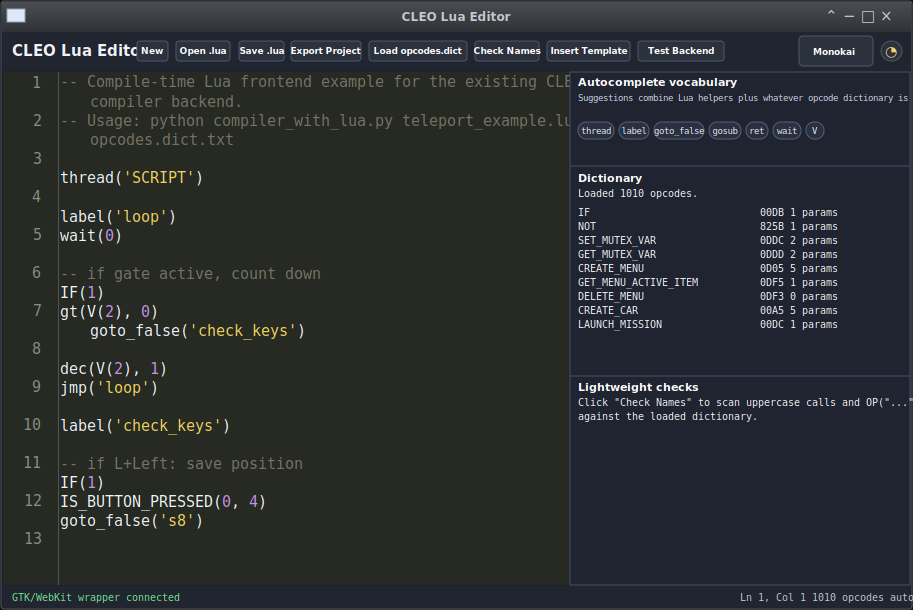

# CLEO Lua Editor WebUI

This is the `bootstrap-webui` idea shaped into a CLEO Lua authoring app.



## Why this matters

The central experiment here is not just a nice editor shell: this project can compile CLEO script outside of Sanny Builder. The current workflow is still split in two parts — write/edit in the GTK/WebKit Ace UI, then run the standalone compiler from the command line — but the compiler path is real and produces `.csi` output. A GUI "Compile" button is future wiring, not the missing core feature.

## Project tour

This repository is split into a small desktop wrapper, a browser-based editor UI, a working compile-time Lua-to-CLEO compiler path, and example data/scripts. If you are new to the project, start with these pieces:

- `webkit-ui.py` is the desktop shell. It starts a local Flask server, serves the app from this directory, opens `index.html` in a GTK/WebKit2 window, exposes simple backend health/test routes, and provides `/api/save_text` so the WebKit wrapper can save files into `exports/`.
- `index.html` is the editor application. It loads Bootstrap, jQuery, and Ace from local files, builds the toolbar/sidebar/status UI, loads opcode dictionaries, provides autocomplete/checking helpers, and falls back to browser Blob downloads when it is opened outside the GTK wrapper.
- `compiler_with_lua.py` is the standalone compiler path and the main technical payoff. It runs user `.lua` files through a compile-time Lua prelude that emits CLEO-style source lines, then the Python compiler backend parses labels, opcodes, operands, and writes `.csi` bytecode.
- `opcodes.dict.txt` is the main opcode dictionary consumed by the editor and compiler. The browser UI uses it for autocomplete/checking, while the compiler uses it to map emitted opcode names to numeric opcodes and operand definitions.
- `examples/` contains starter material: a teleport Lua example, a generated CLEO-text version, a compiled `.csi`, and a smaller sample dictionary for experimentation.
- `js/ace/`, `js/`, and `css/` contain vendored browser assets so the editor can run locally without a CDN.
- `download_ace.sh` is a helper for refreshing the local Ace files when needed.

## How the pieces fit together

1. `python3 webkit-ui.py` starts Flask on `127.0.0.1:5111` and opens a GTK/WebKit2 window.
2. WebKit loads `index.html` from the local Flask server.
3. The editor initializes Ace in Lua mode, loads local UI assets, and can load an opcode dictionary.
4. Dictionary names become autocomplete suggestions and can be checked against uppercase Lua calls or explicit `OP("...")` calls.
5. Save/export actions call the wrapper backend when available, writing files to `exports/`; outside the wrapper, the UI uses normal browser downloads.
6. Compilation works today through the separate command-line flow in `compiler_with_lua.py`; the UI just does not have a button wired to that backend yet.

## Dependencies

The imports from `json`, `os`, `re`, `sys`, `threading`, and `pathlib` are Python standard library modules. The non-stdlib runtime pieces are:

- **Flask**: third-party Python web framework used by `webkit-ui.py` to serve the local app and backend routes.
- **PyGObject / `gi`**: Python bindings for GObject-introspection libraries. This is what makes `from gi.repository import Gtk, WebKit2, GLib` work.
- **GTK 3 and WebKitGTK 2 GIR packages**: native system packages required by PyGObject at runtime.
- **Lua executable**: required only for the standalone Lua compiler frontend in `compiler_with_lua.py`.

`requirements.txt` lists the Python packages, but PyGObject/WebKitGTK are often smoother to install from your OS package manager because they depend on native libraries.

## What it does

- Opens as a GTK/WebKit desktop app with `webkit-ui.py`
- Serves `index.html` from Flask on `127.0.0.1:5111`
- Uses Ace Editor for Lua highlighting, indentation, snippets, and autocomplete
- Loads your existing `opcodes.dict.txt` / JSON dictionary in the browser
- Generates autocomplete from dictionary names
- Saves `.lua` files with browser Blob downloads
- Exports a project JSON bundle containing the current source + loaded opcode dict
- Compiles Lua-authored CLEO scripts to `.csi` through `compiler_with_lua.py`
- Keeps compilation as a command-line step for now; the editor UI does not yet have a compile button

## Install runtime deps

Debian/Ubuntu-ish system packages:

```bash
sudo apt install python3-gi gir1.2-gtk-3.0 gir1.2-webkit2-4.0 python3-flask lua5.4
```

Or install the Python packages from `requirements.txt` when your system already has the native GTK/WebKit development/runtime libraries available:

```bash
python3 -m pip install -r requirements.txt
```

## Ace editor assets

The Ace files needed by the editor are already vendored in `js/ace/`, so no download is required for a normal checkout. The important files are:

```text
js/ace/ace.js
js/ace/ext-language_tools.js
js/ace/mode-lua.js
js/ace/theme-monokai.js
js/ace/theme-chrome.js
```

Refreshing Ace is optional and mostly a matter of user discretion. If you do want newer Ace files, use `download_ace.sh` or copy the matching files from an Ace release package's `src-min-noconflict/` directory.

## Run

```bash
python3 webkit-ui.py
```

For normal use, prefer the wrapper. Opening `index.html` directly is only a static UI/development preview and does not use the intended backend trust boundary.

## Compile a script

```bash
python3 compiler_with_lua.py my_script.lua opcodes.dict.txt
```

This command writes a generated CLEO-text file next to the Lua source and emits the compiled `.csi` next to the input script. The editor is currently the authoring surface, while the command-line compiler is the working compilation path.


## Saving files

Inside the GTK/WebKit wrapper, **Save .lua** and **Export Project** write to:

```text
exports/
```

This is intentional. WebKitGTK may not show a normal browser "Save As" dialog for
Blob downloads unless native download handling is wired into the wrapper, so the
app uses a small Flask `/api/save_text` route and writes to a predictable local
folder. If you open `index.html` directly as a static development preview,
the backend token is unavailable and save actions fall back to browser Blob download behavior.

## CLEO-Lua Syntax Primer

This editor writes a small Lua-flavored layer that generates normal CLEO source for the compiler. The goal is not to replace CLEO opcodes; the goal is to make them easier to write, autocomplete, reuse, and organize.

The pipeline is:

```text
.lua source
→ Lua bridge expands helpers/opcodes
→ generated CLEO text
→ compiler emits .csi bytecode
```

### Minimal script shape

A typical script starts with a thread name, labels, waits, opcode calls, and jumps:

```lua
thread("SCRIPT")

label("loop")
wait(0)

PRINT_HELP("HELLO")

jmp("loop")
```

This roughly generates old-style CLEO source like:

```text
thread 'SCRIPT'

:loop
WAIT_TIME_INT 0
PRINT_HELP "HELLO"
GOTO_@LABEL @loop
```

### Locals, globals, and labels

The bridge uses short helper functions for CLEO operand types.

```lua
V(0)        -- local variable 0@ 
V(12)       -- local variable 12@

G(500)      -- global variable $500

L("loop")   -- label reference @loop
label("loop") -- label definition :loop
```

Most of the time you will not need `L("name")` directly, because helpers like `jmp()`, `gosub()`, and `goto_false()` accept a plain label name.

```lua
jmp("loop")
gosub("get_position")
goto_false("s8")
```

### Calling normal opcodes

Opcode names from the loaded dictionary can be called directly when they are valid Lua-style names.

```lua
GET_PLAYER_CHAR(V(0), V(1))
PRINT_HELP("TSAVE")
PRINT_WITH_NUMBER("ONEX", V(6), 1000, 0)
SET_PLAYER_CONTROL(V(0), 1)
```

The editor autocomplete is built from the loaded opcode dictionary. When you select an opcode, it inserts a call with placeholder arguments based on the opcode’s known parameter count.

Example:

```lua
GET_PLAYER_CHAR(arg1, arg2)
```

You then replace the placeholders with real values:

```lua
GET_PLAYER_CHAR(V(0), V(1))
```

### Raw opcode escape

Some opcode names contain characters that are awkward or illegal in normal Lua function names, such as `@`, `>`, `=`, or `-`.

For those, use the raw opcode escape.

Depending on the current bridge build, the raw escape may be exposed as:

```lua
OP("GOTO_IF_FALSE_@LABEL", L("s8"))
```

or the shorter editor shorthand:

```lua
$("GOTO_IF_FALSE_@LABEL", L("s8"))
```

Both mean: “emit this exact opcode name from the dictionary with these arguments.”

Examples:

```lua
OP("GOTO_@LABEL", L("loop"))
OP("GOTO_IF_FALSE_@LABEL", L("s8"))
OP("LOCAL_VAR_INT_>_LITERAL_INT", V(2), 0)
OP("LOCAL_VAR_INT_-=_LITERAL_INT", V(2), 1)
```

If your build supports the `$()` shorthand:

```lua
$("GOTO_@LABEL", L("loop"))
$("GOTO_IF_FALSE_@LABEL", L("s8"))
$("LOCAL_VAR_INT_>_LITERAL_INT", V(2), 0)
$("LOCAL_VAR_INT_-=_LITERAL_INT", V(2), 1)
```

The raw escape is the “get out of my way” tool. If autocomplete knows the opcode but Lua cannot call it directly as a function, use the raw escape.

### Sugar helpers

The bridge also provides small helper names for common patterns. These are shown in the editor’s helper/sugar panel.

Common helpers:

```lua
thread("SCRIPT")        -- thread name
label("loop")           -- define :loop
wait(0)                 -- WAIT_TIME_INT 0

jmp("loop")             -- GOTO_@LABEL @loop
goto_false("s8")        -- GOTO_IF_FALSE_@LABEL @s8
gosub("get_position")   -- GOSUB_@LABEL @get_position
ret()                   -- RETURN

V(2)                    -- 2@
G(500)                  -- $500
L("loop")               -- @loop
```

Common arithmetic / comparison helpers:

```lua
seti(V(2), 300)         -- local int = literal int
dec(V(2), 1)            -- local int -= literal int
gt(V(2), 0)             -- local int > literal int
int_from_float(V(6), V(3))
```

These helpers are just friendlier names for known CLEO opcode patterns. They do not add magic to the game; they only generate normal compiler input.

### IF blocks and conditional jumps

CLEO-style condition flow is still explicit. A common pattern is:

```lua
IF(1)
IS_BUTTON_PRESSED(0, 4)
goto_false("not_pressed")

PRINT_HELP("PRESSED")

label("not_pressed")
```

For button combos, you can chain checks:

```lua
IF(1)
IS_BUTTON_PRESSED(0, 4)      -- L
goto_false("skip_save")

IF(1)
IS_BUTTON_PRESSED(0, 10)     -- Left
goto_false("skip_save")

PRINT_HELP("TSAVE")
gosub("get_position")

label("skip_save")
```

This keeps the generated CLEO close to what you would have written by hand, but removes most of the label/opcode typing pain.

### Example: save and restore position

```lua
thread("SCRIPT")

label("loop")
wait(0)

-- cooldown gate
IF(1)
gt(V(2), 0)
goto_false("check_keys")

dec(V(2), 1)
jmp("loop")

label("check_keys")

-- L + Left: save position
IF(1)
IS_BUTTON_PRESSED(0, 4)
goto_false("s8")

IF(1)
IS_BUTTON_PRESSED(0, 10)
goto_false("s8")

PRINT_HELP("TSAVE")
seti(V(2), 300)
gosub("get_position")

label("s8")

-- L + Right: return to saved position
IF(1)
IS_BUTTON_PRESSED(0, 4)
goto_false("s9")

IF(1)
IS_BUTTON_PRESSED(0, 11)
goto_false("s9")

PRINT_HELP("TLOAD")
seti(V(2), 300)
gosub("teleport_to")

label("s9")

jmp("loop")
```

### Strings and numbers

Use normal Lua strings:

```lua
PRINT_HELP("TSAVE")
PRINT_WITH_NUMBER("ONEX", V(6), 1000, 0)
```

Use normal numeric literals:

```lua
0
1
300
1000
0.0
-25.5
```

The compiler decides how each operand is encoded in bytecode.

Practical note: many CLEO text-display opcodes expect short ASCII strings. Keep HUD/help labels short unless you know the target opcode supports longer text.

### Comments

Lua comments use `--`.

```lua
-- This is a Lua comment
PRINT_HELP("HELLO")
```

Block comments use:

```lua
--[[
This is a longer comment.
It can span multiple lines.
]]
```

Old CLEO comments using `;` are for generated CLEO text, not Lua source.

### Generated source

The Lua bridge writes an intermediate generated text file before compiling.

Example:

```text
examples/teleport_example.lua
→ examples/teleport_example.generated.txt
→ examples/teleport_example.csi
```

If something compiles strangely, inspect the `.generated.txt` file. It shows the old-style CLEO source that Lua produced.

### Common gotchas

#### “Unknown uppercase call”

The editor’s name checker treats uppercase calls as possible opcode calls. If you see:

```text
Unknown uppercase call: SOMETHING
```

then either:

1. the opcode dictionary does not contain that name,
2. the opcode was mistyped,
3. the helper should be lowercase,
4. or the call should use the raw opcode escape.

#### Lua syntax errors

The red gutter marker comes from Ace’s Lua syntax checker. This means the Lua file itself is malformed before the CLEO compiler even gets involved.

Common causes:

```lua
PRINT_HELP("HELLO"   -- missing closing parenthesis
label(loop)          -- loop should be quoted: "loop"
```

Correct:

```lua
PRINT_HELP("HELLO")
label("loop")
```

#### Opcode names with symbols

This will not work as a normal Lua function call:

```lua
GOTO_IF_FALSE_@LABEL(L("s8"))
```

Use the raw escape:

```lua
OP("GOTO_IF_FALSE_@LABEL", L("s8"))
```

or, if enabled:

```lua
$("GOTO_IF_FALSE_@LABEL", L("s8"))
```

#### Autocomplete placeholders are not real code

Autocomplete may insert:

```lua
GET_PLAYER_CHAR(arg1, arg2)
```

Replace `arg1`, `arg2`, etc. with real operands:

```lua
GET_PLAYER_CHAR(V(0), V(1))
```

### Suggested workflow

1. Load an opcode dictionary.
2. Start from an example script.
3. Use autocomplete to discover opcodes.
4. Prefer sugar helpers for labels, locals, jumps, and common operations.
5. Use `OP("...")` or `$("...")` for ugly opcode names.
6. Run **Check Names**.
7. Save the `.lua`.
8. Compile with the Python compiler.
9. If needed, inspect the generated CLEO text file.

### Further reading

Lua syntax and language reference:

* [Lua Reference Manuals](https://www.lua.org/manual/)
* [Lua 5.4 Reference Manual](https://www.lua.org/manual/5.4/)
* [Programming in Lua, first edition online](https://www.lua.org/pil/contents.html)

For this project, you usually only need basic Lua function calls, strings, numbers, comments, and simple helper functions. The CLEO opcode dictionary remains the real vocabulary for game behavior.


## Security posture

This is a local desktop WebKit app with local filesystem/compiler capabilities. Treat the Flask backend as a private app backend for the bundled UI, not as a general-purpose web service.

- Launch the app through the wrapper with `python3 webkit-ui.py`.
- Do **not** open `index.html` directly in your everyday browser for normal use. The app is designed to run inside its local WebKit window, with a local backend and restricted navigation. Opening it in a normal browser mixes the app with browser extensions, cookies, tabs, download behavior, and other ambient web state.
- The backend binds only to `127.0.0.1`; do not change it to `0.0.0.0` for a release build.
- Requests with unexpected `Host` headers are rejected before routing.
- Responses include a Content Security Policy plus `nosniff`, `no-referrer`, and `no-store` headers to block remote subresources and reduce ambient browser behavior.
- Privileged backend routes require a random per-run `X-App-Token`, reject non-JSON action requests, only accept local origins, and enforce small request/body limits. The token is injected into the served page for the current run only; do not store it in `localStorage`, IndexedDB, exported project files, or logs.
- File writes are resolved by Python and contained inside known app folders such as `exports/`. User-provided filenames are sanitized, must use an allowed extension (`.lua`, `.txt`, or `.json`), and are written atomically via a temporary `.part` file before replacement.
- The WebKit window blocks navigation away from the local app. Developer extras and the right-click context menu are disabled by default; use `python3 webkit-ui.py --dev` when you intentionally want inspector/debug behavior. Dev mode is marked in the window title.
- Do not add remote scripts/CDNs or load untrusted web pages into the app window. Ace is vendored locally under `js/ace/`.
- Treat XSS as token theft: render project/opcode/file/compiler data with `textContent` or DOM text nodes, not `innerHTML`.
- Do not add a generic `/api/run` or pass user-provided strings to `shell=True`. Future compile/ADB actions should stay as narrow, tokened job routes with known paths, explicit argument lists, timeouts, subprocess-tree cleanup, and returned stdout/stderr.

Before release, run the asset audit script and, with the wrapper running, the security smoke test:

```bash
./tools/audit_release_assets.sh
./tools/security_smoke.sh
```

